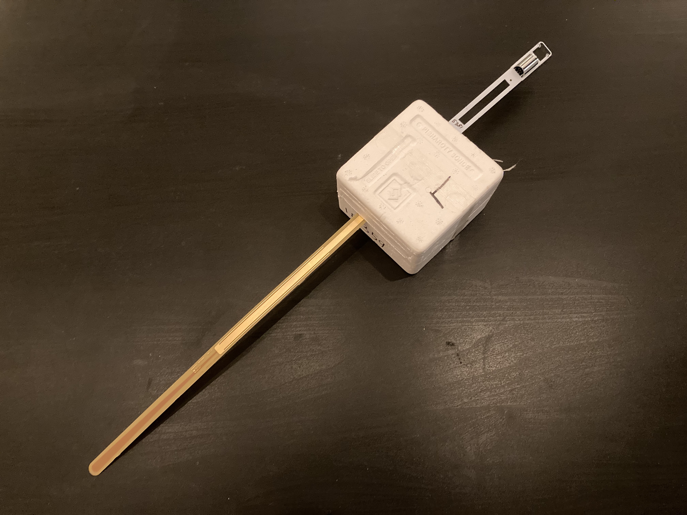
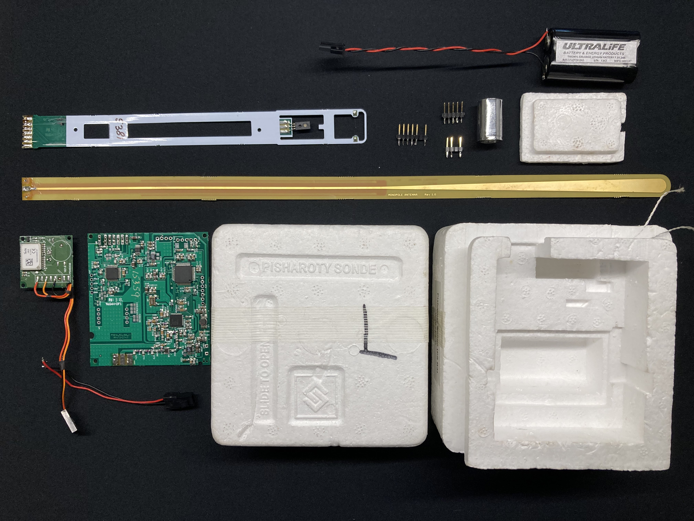
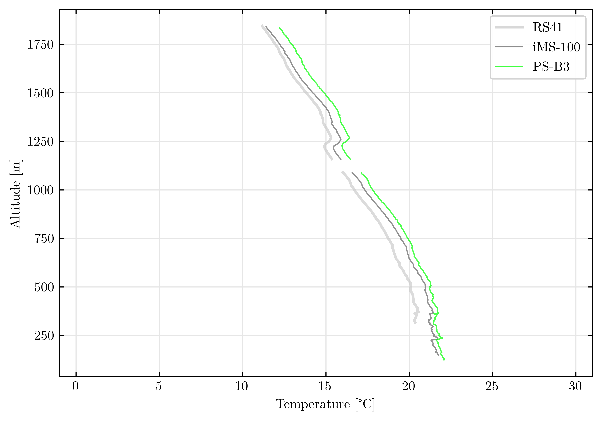
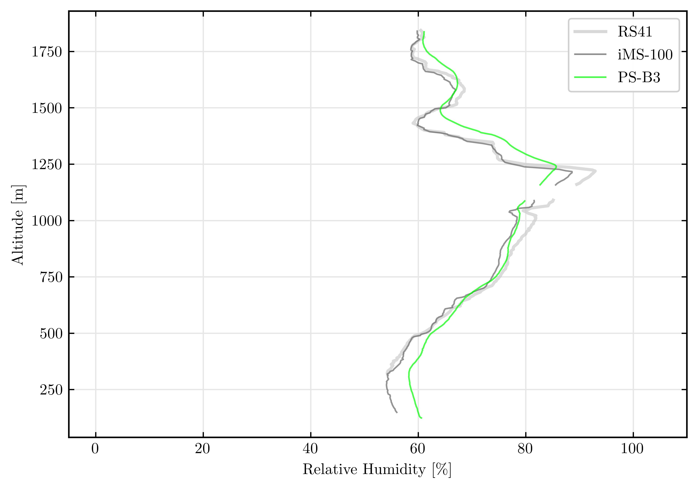
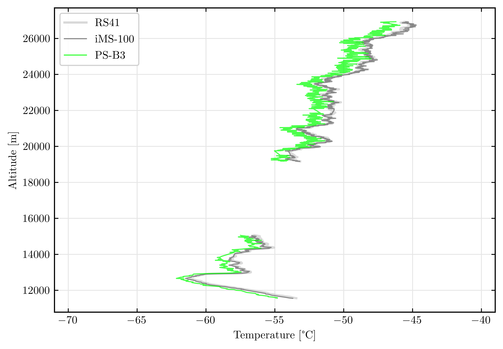
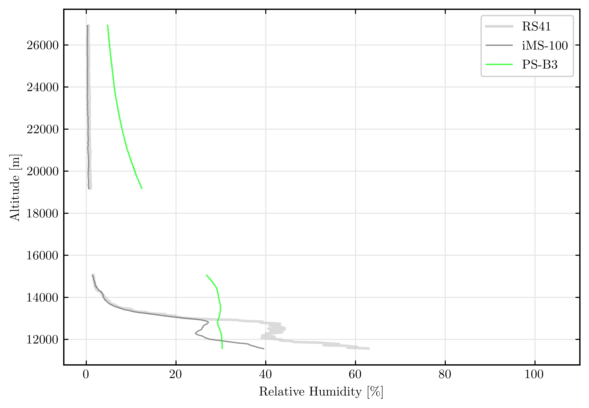
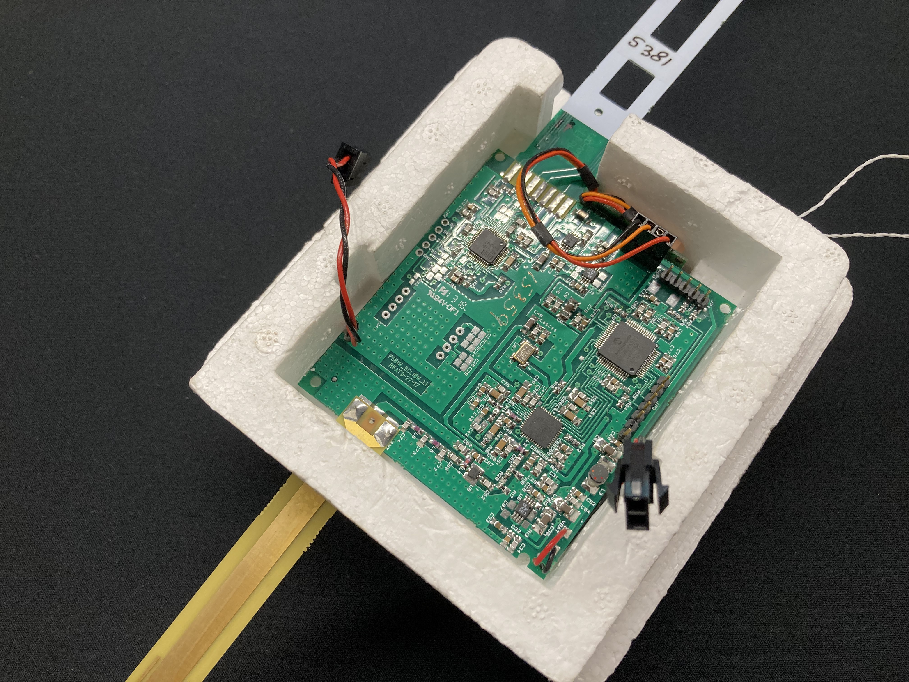
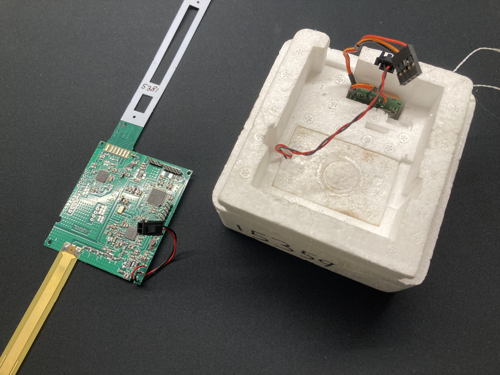
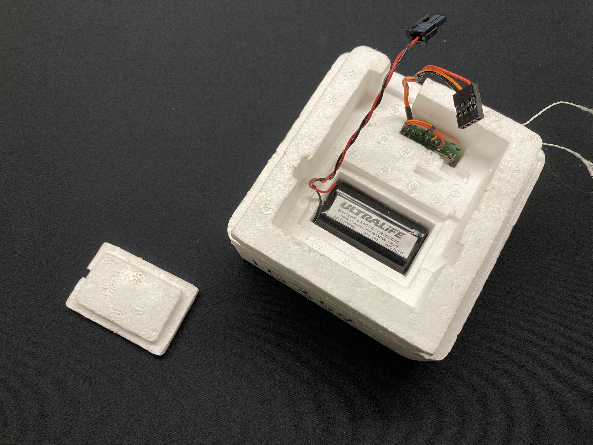

<!-- Required extensions: mdx_math(enable_dollar_delimiter=1) -->
# Vikram Pisharoty Sonde PS-B3

## Description

**Assembled Radiosonde**

**Exploded View**

### MCU and GPS

#### MCU

The MCU is a Microchip PIC18LF6527 in an LQFP64 package with 48K flash and 1K EEPROM. Its memories are unlocked, and you can read out the firmware via the debug connector JP4 using standard Microchip tools.

Once the firmware has configured the radio chip, it switches over from its internal clock to a crystal controlled 10MHz clock from the radio.

A esrvice connector (UART2, 2400 baud) is available at connector JP3. Firmware decides after RESET if service connection must be activated. Pull JP3.4 (“nSERVICE”) low during and after RESET. Firmware will then enter a loop exclusively handling UART2 service commands.

#### GPS

The Telit JN3 GPS module is located on an external PCB, together with a rather large patch antenna. It is connected to the main board by a separable three-wire connection that carries power (+3.3 V), ground and a UART line operating at 9600 baud. This unidirectional connection means that the main processor doesn't have to (and cannot) configure the GPS module. JN3 operates in NMEA mode, and sends the following NMEA sentences at a rate of one per second: GGA, GSA, GSV, RMC. Of these four sentences, GSV can occur multiple times depending on the number of satellite vehicles in sight/use. The main MCU ignores GSV sentences, however, and only makes use of GGA, GSA and RMC.

### Radio

The Analog Devices ADF7021 is a transceiver chip of which only the transmitter part is used here. A Qorvo PA boosts the output power to 19 dBm (1 dB compression).

Modulation is 2FSK with 5.0 kHz deviation. Data bits are sent Manchester encoded at a remarkably low rate of 384 bit/s (768 smbols/s).

### Analog

Ambient temperature is measured by an NTC on the sensor boom. The NTC is biased via a 56k2 resistor from the 1.25 V internal reference of an Analog Devices ADC1218 24-bit ADC. A commercial humidity sensor (Honeywell HIH4021) converts humidity to voltage, and is also connected to the ADS1218. The PS-B3 seems to have an option for an external sensor, which can use an additional channel on the ADC.

Only 16 bits of the ADC results are sent in the radio frame. However, 16 bits are enough to cover the dynamic range of the NTC (exponential resistance-vs-temperature characteristic) with sufficient resolution in a single range.
The parameters of the NTC are unknown, but can be guessed from comparisons with other sondes made during the UAII2022 measurement campaign: $\mathrm{R}_{25}=1000\Omega, \mathrm{B}=2800K$

Let $t_{16}$ be the raw 16-bit ADC result of the temperature measurement, then the absolute resistance of the NTC is $\mathrm{R}=\frac{t_{16}}{65536-t_{16}}\cdot 56.2k\Omega$, and the temperature in degrees Celsius is $\mathrm{T}=\frac{1}{\frac{1}{298.15}+\frac{1}{\mathrm{B}}\ln\frac{\mathrm{R}}{\mathrm{R}_{25}}}-273.15$

The humidity sensor has a voltage output that changes linearly with humidity. A 15k/47.5k voltage divider adapts the 5V output of the sensor to the 1.25V input of the ADC.

Let $u_{16}$ be the raw 16-bit ADC result of the humidity measurement, then the true sensor output voltage is $\mathrm{V_{out}}=\frac{u_{16}}{65536} \cdot 1.25V \cdot \frac{47.5+15}{15}$. From the datasheet we get a first approximation of the relative humidity in percent: $\mathrm{RH_{raw}}=\frac{\frac{\mathrm{V_{out}}}{5.0}-0.16}{0.0062}\%$. The final value for the relative humidity is obtained by applying a temperature correction using the temperature in degrees Celsius: $\mathrm{RH}=\frac{\mathrm{RH_{raw}}}{1.0546-0.00216 \cdot \mathrm{T}}$

Results for test flights during [UAII2022](https://www.gruan.org/community/campaigns/uaii2022) are shown below. While temperature sensor measurements hof te PS-B3 can be trusted, the humidity measurements are only valid at low altitudes.

<u>PS-B3 vs. iMS-100/RS-41 at low altitude. Temperature and humidity both match the reference sondes.</u>

{: width="500px"} {: width="500px"}

<u>PS-B3 vs. iMS-100/RS-41 for altitudes 12...26 km. Temperature still very accurate, but humidity result not useful.</u>

{: width="500px"} {: width="500px"}

### Powersupply

An external battery provides 7.2 V to the board via a cable connector. There is no separate on/off switch.

Three regulators provide power to different parts of the sonde:

* LDO U3 delivers 3.3 V to MCU, 24-bit ADC, GPS receiver, add-on sensor module U4, I2C connector.
* LDO U5 delivers 3.3 V to the radio and the PA.
* Charge pump U1 generates 5.0 V for the humidity sensor from the 3.3 V MCU rail.

Driving 3.3 V linear regulators from a 7.2 V battery results in very poor efficiency. The power consumption of almost 1W is therefore one of the highest of all sondes. The battery capacity of 14.4 Wh by far exceeds that of e.g. Vaisala RS41, whose two AA lithium cells provide 9 Wh.

## Parts List

Designator | Function         | Manufacturer   | Part Number
---------- | ---------------- | -------------- | ---------------
U1         | 5 V charge pump   | Microchip      | [MCP1253](https://ww1.microchip.com/downloads/aemDocuments/documents/APID/ProductDocuments/DataSheets/20001752C.pdf)
U2         | 24 bit ADC       | TI             | [ADS1218](https://www.ti.com/lit/gpn/ads1218)
U3         | 3.3V LDO MCU/ADC | Analog Devices | [LT1962EMS8-3.3](https://www.analog.com/media/en/technical-documentation/data-sheets/1962fb.pdf)
U4         | Add-on sensor (optional)
U5         | 3.3 V LDO RF      | Analog Devices | [LT1962EMS8-3.3](https://www.analog.com/media/en/technical-documentation/data-sheets/1962fb.pdf)
U6         | TCXO 20 MHz      |                |
U7         | Radio            | Analog Devices | [ADF7021](https://www.analog.com/media/en/technical-documentation/data-sheets/ADF7021.pdf)
U8         | PA               | Qorvo          | [SPF5122Z](https://www.qorvo.com/products/d/da001904)
U9         | MCU              | Microchip      | [PIC18LF6527](https://www.microchip.com/en-us/product/PIC18F6527)
           | Humidity Sensor  | Honeywell      | [HIH-4021](https://prod-edam.honeywell.com/content/dam/honeywell-edam/sps/siot/en-us/products/sensors/humidity-with-temperature-sensors/hih-4010-4020-4021-series/documents/sps-siot-hih4010-4020-4021-series-product-sheets-009020-1-en-ciid-51481.pdf)
           | GPS Receiver     | Telit          | JN3

## Detail Photos

**Main PCB Scan**

**Sensor Boom Scan**

